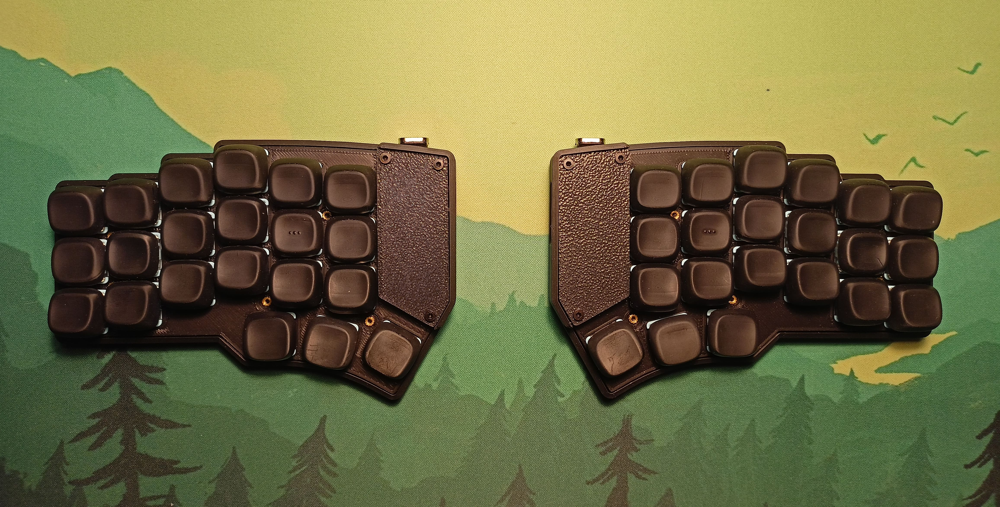
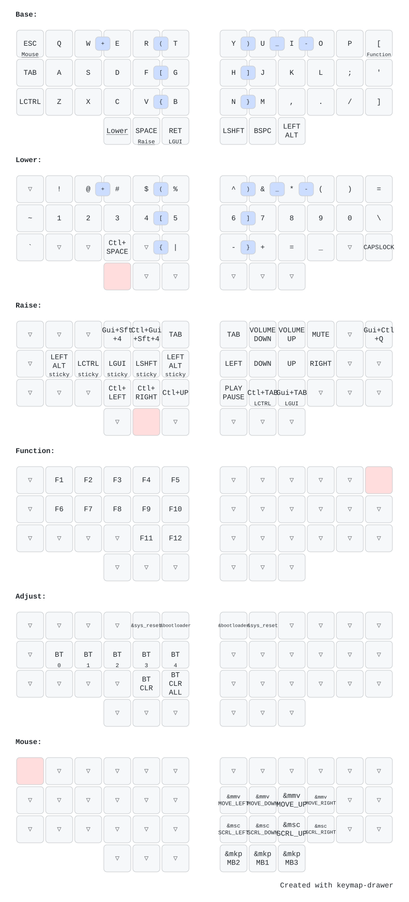

# Dao keyboard | ZMK config

- Keyboard Repo: https://github.com/yumagulovrn/dao-choc-ble
- Config based on: https://github.com/yumagulovrn/dao-zmk-config

## Keymap

`Adjust = Lower + Mouse`

## Updating the firmware

0. Update the configs
1. Update the keymap image
    1.1. Go to https://keymap-drawer.streamlit.app/
    1.2. Upload config/dao.keymap (ZMK keymap) & config/info.json (layout)
    1.3. Export YAML & SVG
2. Get firmware
    2.1. Commit & push -> builds will start
    2.2. Download firmware.zip from the GitHub Actions run
3. Flash firmware
    3.1. Turn off the keyboard (both halves)
    3.2. Connect RIGHT half -> double-tap Reset button -> flash `dao_right-zmk.uf2` -> disconnect (it's still off)
    3.3. Connect LEFT half -> double-tap Reset button -> flash `dao_left-zmk.uf2` -> disconnect (it's still off)
    3.4. Turn on left & right halves

If only the keymap changed, it's enough to flash only LEFT half.
